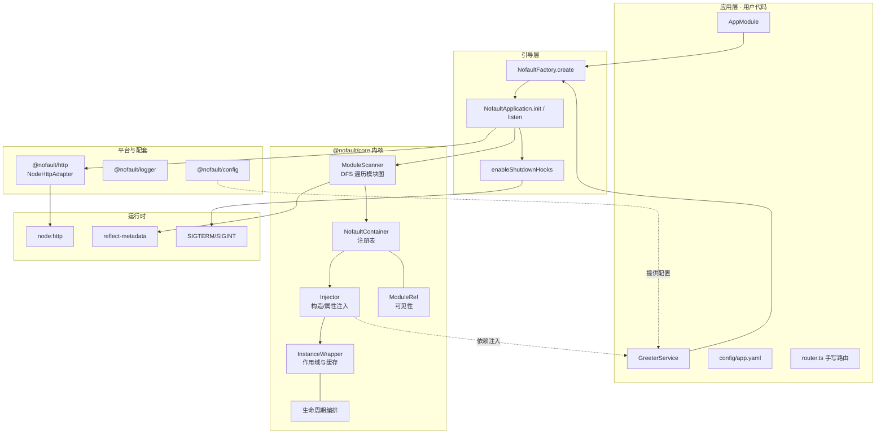

# nofault v0.1.0 架构说明（内核雏形）

> 主题：**IoC 容器 + 模块系统 + 配置 + 日志 + 最小 HTTP 服务**
> 覆盖范围：模块编排（生命周期）+ 配置 + 结构化日志的最小集合
> 规范：**Node.js / NestJS 生态规范**（camelCase 导出、createXxx 工厂）

---

## 1. 这一版要解决的问题

v0.1.0 只回答一个问题：**如何让"声明式的类"被框架托管起来，并能对外提供 HTTP 服务？**

因此刻意不做：路由树、中间件管道、参数校验、异常过滤器、ORM、RPC、服务治理。
这些分别在 v0.2.0 及之后的版本引入。

三条设计红线：

1. **零 Web 框架依赖** —— 直接基于 `node:http`，不引入 Express / Fastify
2. **内核零业务依赖** —— `@nofault/core` 只依赖 `reflect-metadata`
3. **依赖方向单向** —— `@nofault/http` → `@nofault/core`，反向不成立（避免循环依赖）

---

## 2. 架构图


Mermaid 版（便于在支持 Mermaid 的阅读器里查看）：



---

## 3. 模块职责

| 包 | 职责 | 关键类型 |
| --- | --- | --- |
| `@nofault/core` | IoC 容器、模块扫描、生命周期 | `NofaultFactory`、`NofaultApplication`、`NofaultContainer`、`Injector`、`InstanceWrapper`、`ModuleRef` |
| `@nofault/config` | 配置加载与环境覆盖 | `ConfigModule`、`ConfigService`、`loadConfigFile`、`applyEnvOverrides` |
| `@nofault/logger` | 结构化日志 | `Logger`、`ConsoleTransport`、`MemoryTransport` |
| `@nofault/http` | `node:http` 适配器 | `NodeHttpAdapter`、`createHttpApplication`、`sendJson` |

---

## 4. 启动时序

```
main.ts
  └─ createHttpApplication(AppModule)
       ├─ new NodeHttpAdapter()
       └─ NofaultFactory.create()
            ├─ ModuleScanner.scan(AppModule)       // DFS 注册模块图
            ├─ Container.createProviders()         // Provider → InstanceWrapper（惰性）
            ├─ 逐个 wrapper.resolve()              // 真正实例化（TRANSIENT 跳过）
            ├─ Container.lock()
            ├─ onModuleInit()
            └─ onApplicationBootstrap()

  app.use(router)      // 挂载 handler 链
  app.listen(port)
       ├─ adapter.useHandler(chain)
       └─ createServer(...).listen()

  SIGTERM → beforeApplicationShutdown → onModuleDestroy → onApplicationShutdown
            （HTTP 层先停止监听，再等待在途请求排空，最多 5s）
```

---

## 5. 关键设计决策（ADR 摘要）

| 决策 | 选择 | 理由 |
| --- | --- | --- |
| 注入元数据 | `emitDecoratorMetadata` + `reflect-metadata` | 与 NestJS 生态一致，DX 最好 |
| 测试转译器 | **swc**（不是 esbuild） | esbuild 不支持 `emitDecoratorMetadata`，构造函数按类型注入会失效 |
| 示例运行方式 | `tsc` 编译后 `node dist/main.js` | 同样因为装饰器元数据；`tsx`/esbuild 不可用 |
| HTTP 适配器绑定 | 平台包提供 `createHttpApplication()` | 内核保持纯净，避免 core ↔ http 循环依赖 |
| 构建顺序 | 自研拓扑排序脚本逐个 `tsc -p` | dev（指向 src）与 build（指向 dist）需要两套解析规则，项目引用反而更绕 |
| 可见性 | 模块 exports 白名单 + 全局模块 | 与 NestJS 语义一致，报错信息可直接定位缺失的 import |

完整决策记录见 `../../ai-doc/03-architecture/ADR-0001-ioc-and-toolchain.md`。

---

## 6. 已知限制（下一版解决）

1. 路由是 `switch` 手写 —— v0.2.0 引入 Radix 树 + 装饰器路由
2. 没有参数绑定与校验 —— v0.2.0 引入 DTO + 校验管道
3. 没有异常过滤器 —— v0.2.0 引入 `@Catch()` 与统一错误码
4. REQUEST 作用域预留但未启用 —— v0.3.0 引入 `AsyncLocalStorage` 请求上下文后启用
5. 配置不支持热更新 —— v0.3.0 引入 watch
