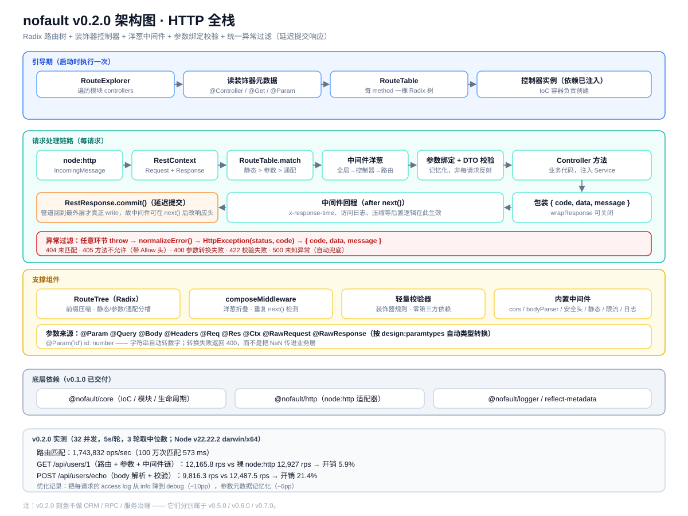
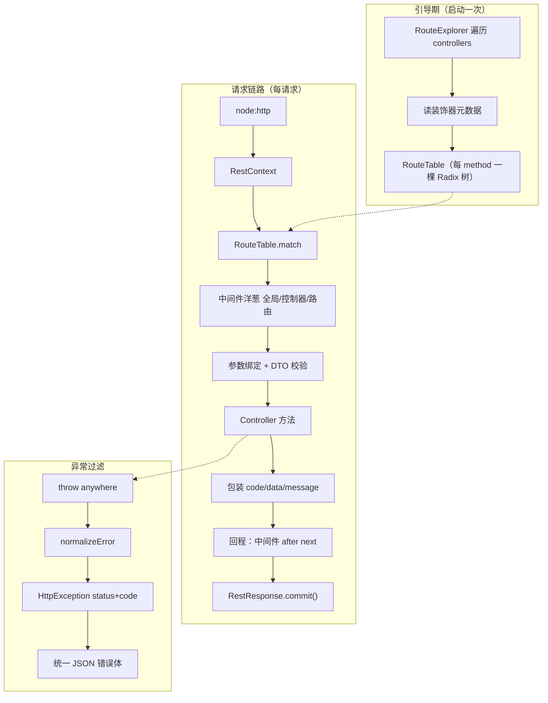

# nofault v0.2.0 架构说明（HTTP 全栈）

> 主题：**Radix 路由 + 装饰器控制器 + 洋葱中间件 + 参数绑定校验 + 统一异常过滤**
> 覆盖范围：`rest` 包 —— 路由引擎 / 中间件链 / HTTP 适配 / 路径参数
> 规范：**Node.js / NestJS 生态规范**

---

## 1. 这一版要解决的问题

v0.1.0 能起服务，但路由是手写 `switch`。v0.2.0 要把它变成**声明式**的：

```ts
@Controller('/users')
export class UserController {
  @Get('/:id')
  detail(@Param('id') id: number) { ... }
}
```

同时补齐 Web 框架该有的四件套：**中间件、参数绑定、校验、异常处理**。

---

## 2. 架构图



Mermaid 版：



---

## 3. 关键设计

### 3.1 路由：每 method 一棵 Radix 树

业界 Radix 路由实现的两个核心点，并做了一处增强：

| 设计 | 通行实现 | nofault |
| --- | --- | --- |
| 按 method 分树 | ✅ | ✅ |
| 静态 / 参数 / 通配 分槽，优先级即匹配顺序 | ✅ | ✅ |
| 静态段前缀压缩 | ❌（未压缩 trie） | ✅（Radix，减少深度与内存） |
| HEAD 回落 GET | 未处理 | ✅ |
| 405 + `Allow` 头 | 未处理 | ✅ |

匹配顺序：**静态 > 参数 > 通配**。注册时若发现冲突（重复路径、同一层不同参数名）直接抛 `RouteConflictError`，把问题暴露在启动期。

### 3.2 响应延迟提交（deferred commit）
