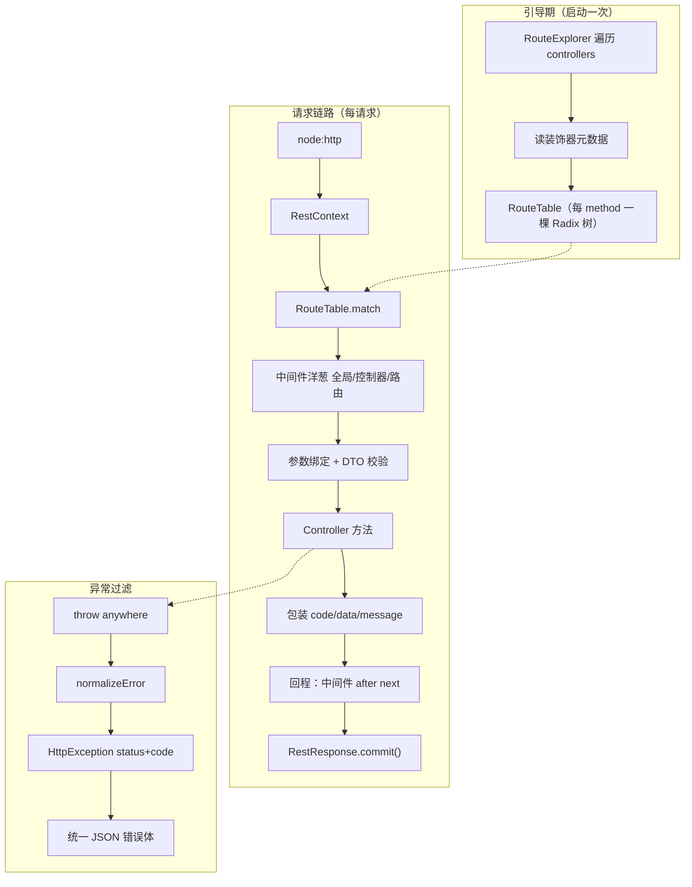

# nofault v0.2.0 架构说明（HTTP 全栈）

> 主题：**Radix 路由 + 装饰器控制器 + 洋葱中间件 + 参数绑定校验 + 统一异常过滤**
> 覆盖范围：`rest` 包 —— 路由引擎 / 中间件链 / HTTP 适配 / 路径参数
> 规范：**Node.js / NestJS 生态规范**

---

## 1. 这一版要解决的问题

v0.1.0 能起服务，但路由是手写 `switch`。v0.2.0 要把它变成**声明式**的：

```ts
@Controller('/users')
export class UserController {
  @Get('/:id')
  detail(@Param('id') id: number) { ... }
}
```

同时补齐 Web 框架该有的四件套：**中间件、参数绑定、校验、异常处理**。

---

## 2. 架构图


Mermaid 版：



---

## 3. 关键设计

### 3.1 路由：每 method 一棵 Radix 树

业界 Radix 路由实现的两个核心点，并做了一处增强：

| 设计 | 通行实现 | nofault |
| --- | --- | --- |
| 按 method 分树 | ✅ | ✅ |
| 静态 / 参数 / 通配 分槽，优先级即匹配顺序 | ✅ | ✅ |
| 静态段前缀压缩 | ❌（未压缩 trie） | ✅（Radix，减少深度与内存） |
| HEAD 回落 GET | 未处理 | ✅ |
| 405 + `Allow` 头 | 未处理 | ✅ |

匹配顺序：**静态 > 参数 > 通配**。注册时若发现冲突（重复路径、同一层不同参数名）直接抛 `RouteConflictError`，把问题暴露在启动期。

### 3.2 响应延迟提交（deferred commit）

这是 v0.2.0 最重要的一条决策。

**问题**：如果业务 handler 直接 `res.end()`，那么中间件里 `await next()` **之后**的代码就再也改不了响应头了——`x-response-time`、压缩、后置日志全部失效。

**解法**：`RestResponse` 只往缓冲区写状态码 / 头 / 体，等管道回到最外层时统一 `commit()`。
这是 Koa 的经典做法，也是洋葱模型真正成立的**前提**。

### 3.3 中间件：洋葱模型

```ts
const timing: Middleware = async (ctx, next) => {
  const t = process.hrtime.bigint();
  await next();                                   // 进
  ctx.response.header('x-response-time', '...');  // 出（因为延迟提交，这里还改得动）
};
```

`composeMiddleware()` 会把数组折叠成单函数，并检测 `next()` 被重复调用。

中间件可以是**函数**，也可以是**带 `use()` 方法的类**（后者由容器解析依赖）。

### 3.4 参数绑定

`@Param` / `@Query` / `@Body` / `@Headers` / `@Req` / `@Res` / `@Ctx` / `@RawRequest` / `@RawResponse`。

- 按 `design:paramtypes` **自动类型转换**：`@Param('id') id: number` 会把 `'42'` 转成 `42`
- 转换失败 → **400**，而不是把 `NaN` 悄悄传进业务层
- 缺省值：`@Query('limit', { default: 20 })`
- 可选：`@Query('kw', { required: false })`

### 3.5 校验：自研轻量校验器

`@IsString @IsInt @IsEmail @MinLength @Min @Max ...` + `@ValidateBody(CreateUserDto)`。

不用 `class-validator` 的原因：依赖较重、同步语义不直观。自研版本 60 行，语义一致，未来可平滑替换。

> **踩坑**：`name!: string` 这类字段没有初始化器，`new Dto()` 上一个自有属性都没有，
> 所以**不能**靠 `Object.keys(instance)` 枚举字段。校验器改为记录"声明过规则的属性名"。

### 3.6 异常处理

任意位置 `throw` → `normalizeError()` → `HttpException(status, code)` → `{ code, data, message }`。

| 场景 | 状态码 |
| --- | --- |
| 路径未匹配 | 404 |
| 路径存在但方法未注册 | 405 + `Allow` 头 |
| 参数类型转换失败 | 400 |
| DTO 校验失败 | 422（附字段级错误明细） |
| 业务抛 `NotFoundException` / `ConflictException` 等 | 对应状态码 |
| 未知异常 | 500（自动兜底，不泄漏堆栈） |

---

## 4. 性能

| 指标 | 数值 |
| --- | --- |
| 路由匹配 | **1,743,832 ops/sec** |
| GET（路由 + 参数 + 中间件） | 12,165.8 rps，开销 **5.9%** |
| POST（body 解析 + 校验） | 9,816.3 rps，开销 **21.4%** |

两处优化记录（详见 `benchmarks/v0.2.0/REPORT.md`）：

1. 每请求 access log 从 `info` 降到 `debug`：**−10 个百分点**
2. 参数元数据记忆化（WeakMap 缓存 `Reflect.getMetadata` + `sort`）：**−6 个百分点**

---

## 5. 已知限制（下一版解决）

1. 无请求上下文（AsyncLocalStorage）—— v0.3.0
2. 配置不支持热更新 —— v0.3.0
3. 数据存内存，无 ORM / 缓存 —— v0.5.0
4. 限流是单机内存版，非分布式 —— v0.7.0
5. 无链路追踪 / 指标 —— v0.8.0
6. 未实现块：拦截器只留了接口，`@Catch()` 过滤器只做了元数据登记，统一由框架默认过滤器处理
