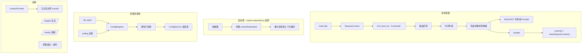

# nofault v0.3.0 架构说明（运行时基座）

> 主题：**请求上下文 + REQUEST 作用域 + 配置热更新 + traceId 日志 + 健康探针**
> 覆盖范围：请求上下文 + 热配置 + 结构化日志 + 生命周期编排
> 规范：**Node.js / NestJS 生态规范**

---

## 1. 这一版要解决的问题

v0.2.0 解决了"请求怎么路由到业务代码"。v0.3.0 解决的是**请求之内**的问题：

1. 业务代码怎么拿到 traceId，而不用在每个函数签名里加 `ctx` 参数？
2. 怎么声明"一次请求一个实例"的服务（UnitOfWork、租户上下文、请求级缓存）？
3. 改了配置文件，能不能不重启就生效？
4. K8s 怎么知道这个实例该不该接流量？

---

## 2. 架构图


Mermaid 版：



---

## 3. 关键设计

### 3.1 请求上下文：AsyncLocalStorage

请求级值传递用 Node 惯用法表达：
**显式对象 + ALS 隐式传播**，而不是把 ctx 当第一个参数到处传。

```ts
const logger = createLogger({ contextProvider: () => currentContext()?.toJSON() });
```

这一行让**每一行日志自动带上 traceId**，业务代码完全无感。

`RequestContext` 同时扮演两个角色：
1. 请求级数据袋（`set` / `get`）
2. 内核 REQUEST 作用域所需的 `contextId`（对象身份即 key）

> **踩坑**：框架在请求入口建上下文，中间件若再建一层，
> 就会出现**两层嵌套上下文**——handler 里读到的 requestId 和请求级 Provider 拿到的不是同一个。
> 因此 `requestContext()` 中间件会**复用**框架已建立的上下文。

### 3.2 REQUEST 作用域 + Captive dependency 检测

```ts
@Injectable({ scope: Scope.REQUEST })
class RequestScopeService {}
```
