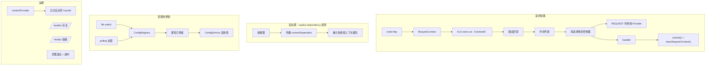

# nofault v0.3.0 架构说明（运行时基座）

> 主题：**请求上下文 + REQUEST 作用域 + 配置热更新 + traceId 日志 + 健康探针**
> 覆盖范围：请求上下文 + 热配置 + 结构化日志 + 生命周期编排
> 规范：**Node.js / NestJS 生态规范**

---

## 1. 这一版要解决的问题

v0.2.0 解决了"请求怎么路由到业务代码"。v0.3.0 解决的是**请求之内**的问题：

1. 业务代码怎么拿到 traceId，而不用在每个函数签名里加 `ctx` 参数？
2. 怎么声明"一次请求一个实例"的服务（UnitOfWork、租户上下文、请求级缓存）？
3. 改了配置文件，能不能不重启就生效？
4. K8s 怎么知道这个实例该不该接流量？

---

## 2. 架构图


Mermaid 版：



---

## 3. 关键设计

### 3.1 请求上下文：AsyncLocalStorage

请求级值传递用 Node 惯用法表达：
**显式对象 + ALS 隐式传播**，而不是把 ctx 当第一个参数到处传。

```ts
const logger = createLogger({ contextProvider: () => currentContext()?.toJSON() });
```

这一行让**每一行日志自动带上 traceId**，业务代码完全无感。

`RequestContext` 同时扮演两个角色：
1. 请求级数据袋（`set` / `get`）
2. 内核 REQUEST 作用域所需的 `contextId`（对象身份即 key）

> **踩坑**：框架在请求入口建上下文，中间件若再建一层，
> 就会出现**两层嵌套上下文**——handler 里读到的 requestId 和请求级 Provider 拿到的不是同一个。
> 因此 `requestContext()` 中间件会**复用**框架已建立的上下文。

### 3.2 REQUEST 作用域 + Captive dependency 检测

```ts
@Injectable({ scope: Scope.REQUEST })
class RequestScopeService {}
```

内核在启动期**沿依赖图传播** REQUEST 作用域：若 A 依赖 B，而 B 是 REQUEST（或已被污染），则 A 也被标记 `contextDependent`，按上下文缓存。

这是必须的。否则单例 Controller 会缓存住第一个请求的对象，
**所有请求共用同一份**——跨请求数据串号，且只在并发下偶发，极难排查。

| 情况 | 行为 |
| --- | --- |
| 纯单例依赖链 | 全局一份（不变） |
| REQUEST 作用域 | 每 contextId 一份 |
| 单例 → REQUEST（captive） | 自动按上下文缓存 |
| TRANSIENT | 每次解析都新建 |

请求结束时 `clearRequestContext(contextId)` 释放，否则 `Map` 会无限增长。

### 3.3 配置热更新：可插拔 Source

```ts
ConfigModule.forRootAsync({ path: 'config.yaml', watch: true })
```

`ConfigSource` 统一抽象，内置四种：

| Source | 说明 |
| --- | --- |
| `createFileSource({ path, watch })` | 文件 + fs.watch（100ms 防抖） |
| `createPollingSource({ fetch, intervalMs })` | 轮询；etcd / consul / nacos 都走它 |
| `createInlineSource(values)` | 内联值、默认值 |
| `createEnvSource(prefix)` | 环境变量，优先级最高 |

合并顺序：**后面的覆盖前面的，环境变量永远最后**。

远程拉取失败时**保留上一次的值**——配置中心的抖动不能把应用打挂。

> **性能坑**：`values()` 曾经每次 `structuredClone`，导致读一个配置项 = 克隆整份配置。
> 现在 `values()` 直接返回内部对象（安全由"整体替换"保证），
> 需要副本时用 `ConfigService.snapshot()`。

### 3.4 健康探针

严格区分两个语义（K8s 约定）：

- **`/healthz` liveness**：进程活着吗？只做最廉价的检查，挂了就重启
- **`/readyz` readiness**：能接流量吗？没就绪就摘掉

注册过 readiness 检查后默认**未就绪**，必须显式 `app.markReady()`——
这是有意的，避免半初始化的实例接流量。

### 3.5 优雅退出

```
markNotReady() → 摘流量
  → 停止监听 → 排在途请求
  → beforeApplicationShutdown → onModuleDestroy → onApplicationShutdown
```

带**超时保护**（默认 5s）：某个 Provider 的 destroy 卡死时进程也必须能退出，
否则 K8s 只能 SIGKILL，那是真丢数据。

---

## 4. 性能

| 指标 | 数值 |
| --- | --- |
| 上下文创建 | 153,130 ops/sec |
| ALS run + current | 142,643 ops/sec（7.01 µs/次） |
| GET config | 7,768.5 rps，开销 35.1% |
| GET context | 8,221.3 rps，开销 30.3% |

基准测试反过来挖出并修掉了两个热路径问题（详见 `benchmarks/v0.3.0/REPORT.md`）：

1. 每次 `config.get()` 全量 `structuredClone` → 开销 −15pp
2. 每请求 3 次 `crypto.getRandomValues` → 上下文快 2.5×

> 相比 v0.2.0 的 5.9%，30~35% **不是回归**：这一版多做了上下文、每请求 DI、探针与热配置。

---

## 5. 已知限制

1. 中间件链未做编译期折叠（框架通行做法），是当前主要开销 → 后续优化
2. 未实现真正的链路追踪（span 上报），只有 traceId 传播 → v0.8.0
3. 无指标采集（Prometheus）→ v0.8.0
4. 无 ORM / 缓存 → v0.5.0
5. 无 RPC → v0.6.0
6. 无熔断 / 限流 → v0.7.0
